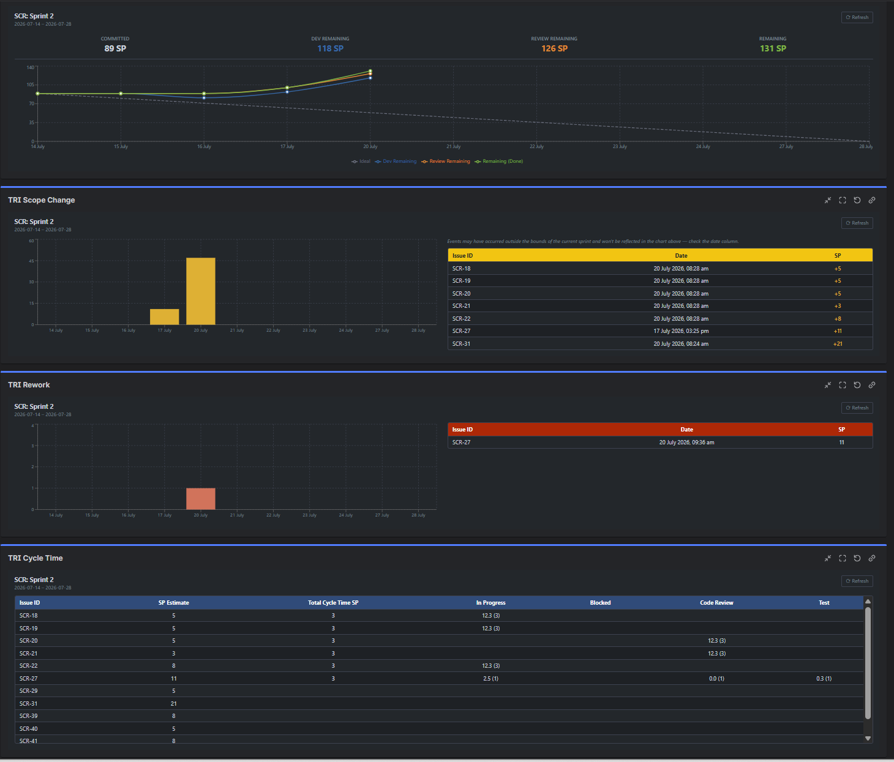
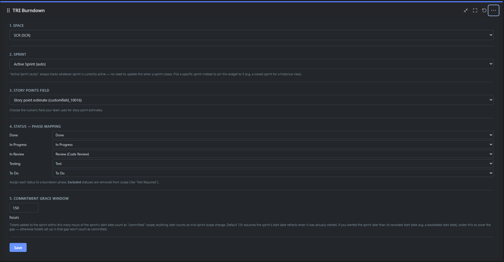
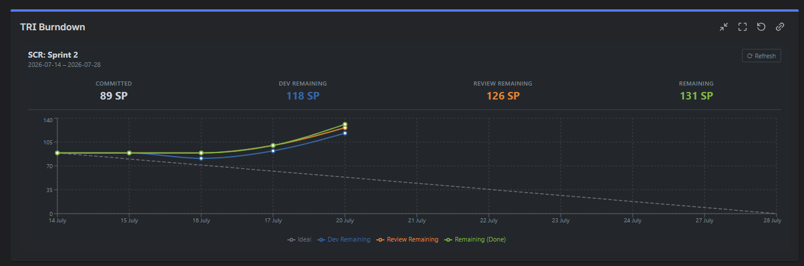
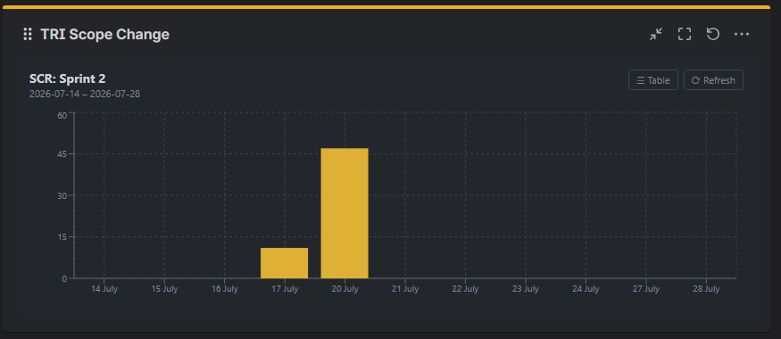
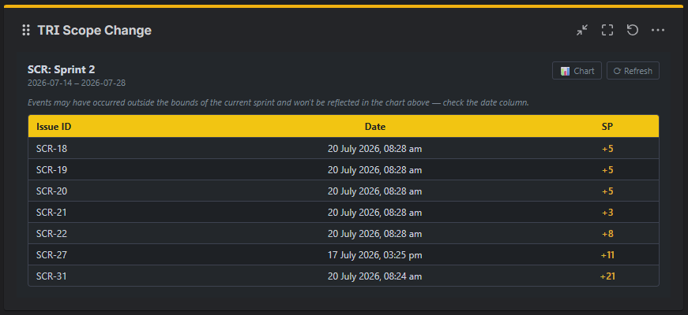
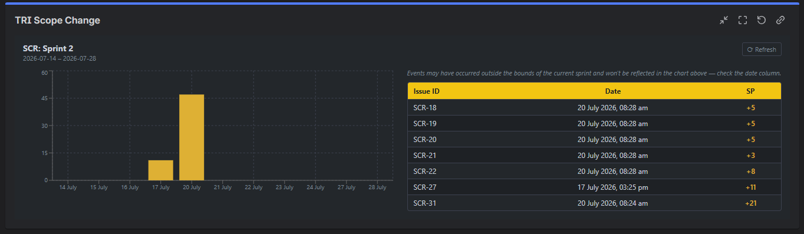
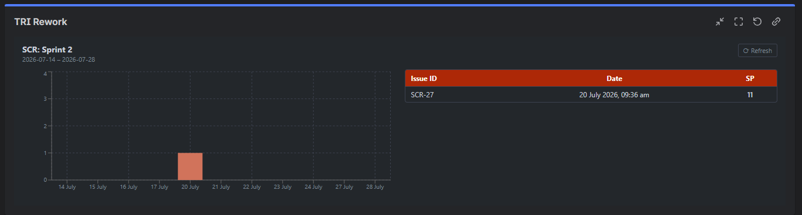
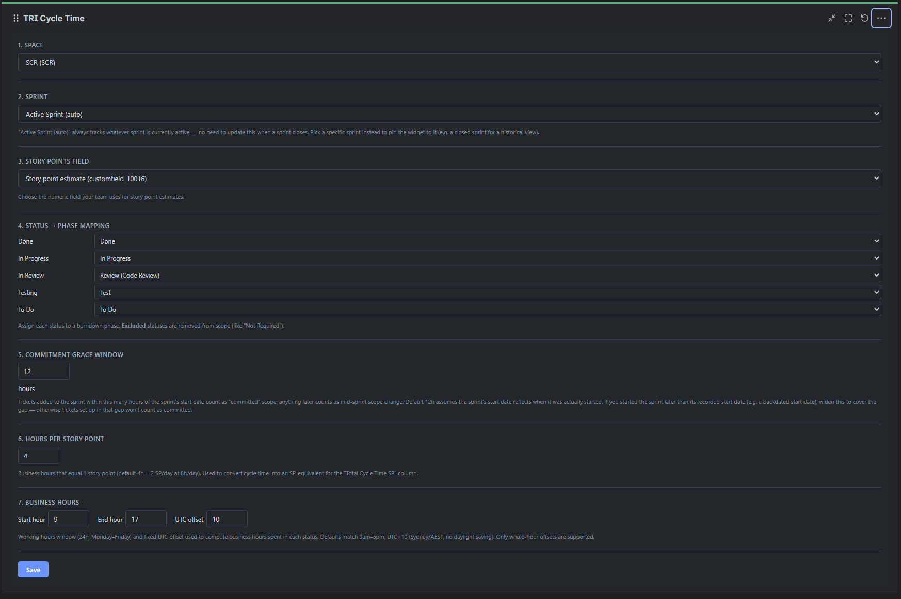
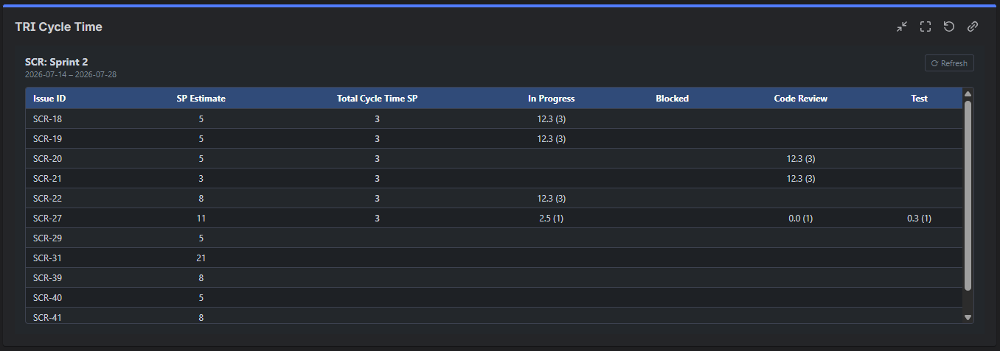

# Using TRI Sprint Dashboard Gadgets

Four Jira dashboard gadgets for sprint reporting:

| Gadget | What it shows |
| --- | --- |
| **TRI Burndown** | A sprint burndown chart with four lines: Ideal, Dev Remaining, Review Remaining, and Remaining |
| **TRI Scope Change** | How much story-point scope was added or removed each day of the sprint, as a chart, a table of individual events, or both |
| **TRI Rework** | How often work gets kicked back out of testing, as a chart, a table of individual events, or both |
| **TRI Cycle Time** | How many business hours each issue spent In Progress, Blocked, in Code Review, and in Test, compared against its story-point estimate |

All four together on one dashboard:

## Adding a gadget to your dashboard

1. Open the dashboard you want to add it to.
2. Click **Add gadget** (usually in the top-right of the dashboard).
3. Search for **TRI Burndown**, **TRI Scope Change**, **TRI Rework**, or **TRI Cycle Time** and add it.
4. The gadget appears with a message asking you to configure it — click **Edit** on the gadget to open its settings.

## Configuring a gadget

Every gadget in this app walks through the same first few settings:

1. **Space** — pick the Jira project you want to report on. You'll see every project you have access to.
2. **Sprint** — leave this on **"Active Sprint (auto)"** and the gadget will always show whichever sprint is currently active for that project, automatically moving to the next sprint once the current one closes — no need to touch this again. Or pick a specific sprint (including a closed one) if you want the gadget locked to that sprint for a historical view.
3. **Story Points Field** — pick the field your team uses for story points.
4. **Status → Phase Mapping** — for each status in your project's workflow, tell the gadget what it represents: To Do, In Progress, Blocked, Review, Test, Done, or Excluded (for things like "Won't Do" or "Not Required" that should drop out of the sprint's scope entirely). This is what lets the gadget work with your team's actual workflow instead of assuming fixed status names.
5. **Commitment Grace Window** — how many hours after a sprint's recorded start date a ticket can still be added and count as originally "committed" scope, rather than as a mid-sprint scope change. The default of 12 hours works for most teams. If your sprint's recorded start date doesn't match when the sprint was actually started (for example, if it was started later than the date on record), widen this to cover the gap.

Click **Save** once you're happy with the settings — the gadget will load your sprint data right away.

## TRI Burndown

## TRI Scope Change and TRI Rework: chart, table, or both

Both of these gadgets add one more setting: **Display As**, with four options — Chart, Table, Both (side by side), or Both (stacked). If you pick just Chart or just Table, a small toggle button next to the gadget's Refresh button lets you switch views on the fly without reopening the settings.

Chart only:

Table only — every individual scope-change event:

Both, side by side (this is what "Both" looks like on a wide enough dashboard column — it stacks into one column automatically on narrow ones):

TRI Rework works the same way — a chart of how often work gets sent back out of testing, and/or a table of each individual rework event:

## TRI Cycle Time

Adds two more settings beyond the shared ones:
- **Hours per Story Point** — how many business hours count as one story point of effort (default: 4 hours, i.e. 2 points per 8-hour day).
- **Business Hours** — your team's working hours and time zone offset (default: 9am–5pm, UTC+10), used to calculate how much time was actually spent working on each issue rather than counting nights and weekends.

It has no chart — just a table, one row per issue, showing each issue's story-point estimate against the business hours (and SP-equivalent) it actually spent in each phase:

## Keeping data fresh

Each gadget caches its sprint data briefly to load faster — active sprints refresh automatically every 5 minutes, and closed sprints are cached until you ask for fresh data. Every gadget has a small **Refresh** button (with a ⟳ icon) to force an immediate update.

## Things to know

- If your project has more than one Scrum board, the gadget uses the first one Jira returns.
- Business-hours calculations (TRI Cycle Time) use a single fixed time-zone offset rather than a full time zone, so they don't automatically adjust for daylight saving.
- Very large sprints (roughly 100+ issues with long histories) may take longer to load the first time, since the gadget reads each issue's full status history.

## Getting help

See [SUPPORT.md](SUPPORT.md) for how to report a problem or ask a question.
